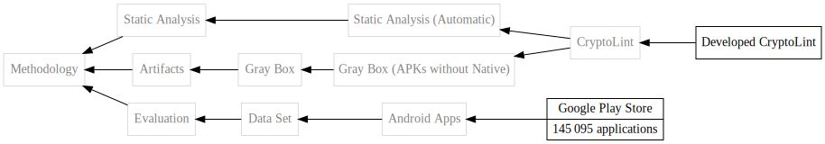

# `sokman` – Manages your SoKs

`sokman` aids in creating reproducible systematic mappings or systematic literature reviews and tries to automate some of the tedious tasks, such as searching, snowballing, and exporting a visual graph representation of the created systematization of knowledge (SoK).

`sokman` is a Django project. It basically uses Django's admin interface and some management commands, so it is designed to run locally – you have been warned.

Data sources:
- [DBLP](https://dblp.org) is used for searching publications, importing publications, and exporting Bibtex entries
- [Semantic Scholar](https://semanticscholar.org) is used for snowballing.

## Systematic Mapping

`sokman` helps keeping track of a systematic mapping process, as described by Petersen [1]. The steps can be performed as described below.

### Definition of Research Question

Sorry, not automated, yet.

### Conduct Search

Use pre-defined search terms, such as `systematic mapping` and then you can search DBLP.

```sh
./manage.py dblpsearch 'systematic mapping'
```

Identified publications can be imported directly or they can be excluded. Known publications will be skipped automatically and excluded publications are memoized and not further asked in subsequent searches but can be reset with `--reset-choices`.
Initial screening can be performed by showing the publication's abstract. Note that excluded publications will not be added to the database, and an exclusion criterion is therefore not documented.

Note that DBLP only performs matching based on the title, author, and venue and does not perform full-text search of the publication. Other sources should be considered, but for now only DBLP is supported.

Publications can be marked as duplicate or variant of other publications in the admin interface.

#### Snowballing

In order to identify additional publications, snowballing should be performed by backward and forward searching references and citations.

```sh
./manage.py snowball
```
If only a backward or forward search should be performed `--no-citations` and `--no-references` can be specified respectively.

Note that importing publications identified through snowballing is not yet possible automatically. Publications have to be added manuall through the admin interface. If the publication is on DBLP, it can simply be imported by using the following command, where the cite key is for example `DBLP:conf/ease/PetersenFMM08`:

```sh
./manage.py dblpimport 'DBLP:conf/ease/PetersenFMM08'
```

Detected references and citations will be automatically added to existing publications. Known publications will be skipped and excluded publications will be memoized and can be reset with `--reset-choices`.

You might need to run this command until no further references are found. You might need to manually add Semantic Scholar paper IDs to publications. Publications that have a DOI can be identified automatically by runnnig:

```sh
./manage.py repair
```

Repair will also add synthetic references and citations if another version or duplicate is identified.

### Screening

Coarse screening based on the abstract of a publication can be performed during searching or snowballing, as the abstract can be shown there and the publication does not need to be included. Note that no exclusion criterion will be assigned to the publication in that case, as the publications will not be added to the database.
Detailed screening can be performed using the admin interface, where relevant publications can be identified and others can be excluded by adding custom exclusion criteria.

#### Publication Stages

Publications are assigned a stage:
- *primary* – Relevant publications that are identified by a search term directly.
- *secondary* – Relevant publications that are cited by a primary publication.
- *tertiary* - Relevant publications that cite a primary publication.
- *excluded* - Irrelevant publications that were excluded with an exclusion criterion.
- *-* – All other publications, including transitive citations/cites.

### Keywording using Abstracts

Keywording can be performed using the admin interface by assigning tags to the publication. For each tag, specific criteria can be added that specify when a tag should be applied to a publication.

### Data Extraction and Mapping Process

Mapping can be performed by setting tags into relation, e. g., by grouping. This can be done by editing tags in the admin interface. Tags can imply other tags.

Tags and citations can be exported in DOT format, which can be rendered using Graphviz.

```sh
# Render relevant publications that have more than ten citations
./manage.py citations --min-citations 10 > graphs/citations.dot && make graphs/citations.svg
# or
make graphs/citations.svg

# Render tag DAG
./manage.py tagtag --root 'Literature on Systematic Mapping' --threshold 1 > graphs/sysmap.dot && make graphs/sysmap.svg

# Render classification for a single publication
./manage.py tagtag 'DBLP:conf/ease/PetersenFMM08' > graphs/petersen08.dot && make graphs/petersen08.svg

# Render with TIKZ
pip install dot2tex
make graphs/citations.tex
```

You can edit the `Makefile` so that you can generate all graphs quickly with:
```sh
make -j 4
```

An example graph generated with:
```sh
./manage.py tagdag --root 'Methodology' 'DBLP:conf/ccs/EgeleBFK13' > example.dot && make example.svg
```



If you want to get the BIB entry from DBLP:

```sh
./manage.py dblptex 'DBLP:conf/ease/PetersenFMM08' >> references.bib
```

## Sharing SoKs

```sh
# Export
./manage.py dumpdata --natural-primary --natural-foreign sok | jq --sort-keys > "fixtures/$(date '+%Y-%m-%d')-sk.json"

# Import
./manage.py loaddata fixtures/2021-03-11-sok.json
```

## Installation

```sh
# Check out repository
git clone https://github.com/blochberger/sokman.git
cd sokman

# Set up virtual environment
python -m venv .env
. .env/bin/activate
pip install --upgrade pip setuptools wheel
pip install -r requirements.txt

# Loading DBLP dumps
cd dblp
curl -O 'https://dblp.org/xml/release/dblp-2019-11-22.dtd'
curl -O 'https://dblp.org/xml/release/dblp-2021-03-01.xml.gz'
gunzip 'dblp-2021-03-01.xml.gz'
cd ..

# Set up
./manage.py makemigrations
./manage.py migrate
./manage.py createsuperuser

# Run web server
./manage.py runserver
```

---

1. Kai Petersen, Robert Feldt, Shahid Mujtaba, Michael Mattsson: [**Systematic Mapping Studies in Software Engineering**](http://ewic.bcs.org/content/ConWebDoc/19543), EASE 2008
